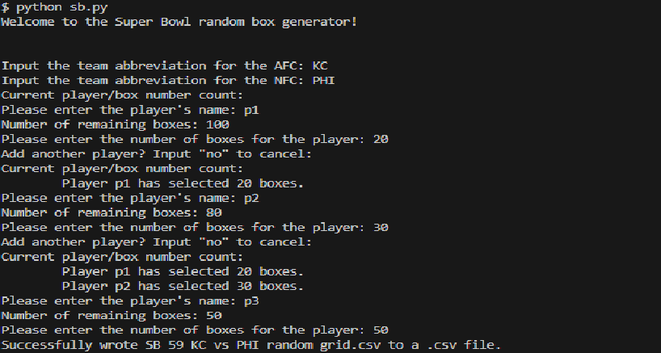

# Random Grid Generator for Super Bowl
A random generator for Super Bowl boxes that can be run from the command line.

## User Guide

The code will prompt you to enter the information about the game and generate the random grid based on this information. In order to generate the grid, you need the following:
- Who is playing in the game (AFC and NFC abbreviations)
- Who are the participants in the game
  - For each participant, how many boxes do they want

Screenshot example:

